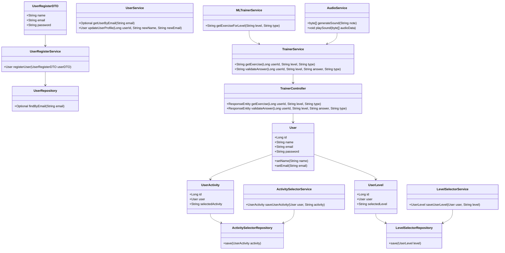

# EarTrainer 🎵
---
---

<p align="center">

</p>

[Portuguese Translation](https://github.com/lelia-salles/eartrainer/blob/main/eartraining/eartrainer/README.md)

## Overview 👀
---
EarTrainer is a RESTful API designed to train musical perception of intervals and chords through interactive activities and progressive levels. It leverages AI and Machine Learning to ensure personalized and progressive learning.

```Developed as the final project for the **GFT Developing in Java with AI GFT** course by DIO.```

## Key Features 🔆
---
- **Level Selection:** Users can choose between beginner, intermediate, and advanced levels for each activity.
- **Ear Training:** Activities to recognize chords and musical intervals by listening.
- **Authentication & User Profile:** Login via email/password or Google OAuth, with a customizable profile.
- **User Profile:** Users can add and edit their information and social media links to share their progress.
- **Audio Processing & Generation:** Dynamically generated sounds with automatic answer validation after 5 attempts.
- **Scalable Architecture & Real-Time Communication:** Optimized database for testing and production with real-time interaction.

## Technologies Used 💾
---
### Backend
- Java 21
- Spring Boot 3.x
- Spring Security & OAuth2
- Spring WebSockets
- Spring Data JPA (PostgreSQL or H2)
- TarsosDSP (Audio Processing)
- Java Sound API (Sound Generation)
- TensorFlow Java (AI & Machine Learning)
- Gradle (Dependency Management)

### Infrastructure & Optimization
- **Railway:** Initially set up for deployment on Railway, with future support for Docker and AWS.

### Frontend
- Thymeleaf (Template testing for the backend)

### UX/UI
- Figma (For future frontend improvements)

[Access >>](https://www.figma.com/design/nWdoJYqm70ZisZ8qdeG17V/EarTrainer?node-id=0-1&t=5aYB5z8hnFgClNc2-1)

### UML


