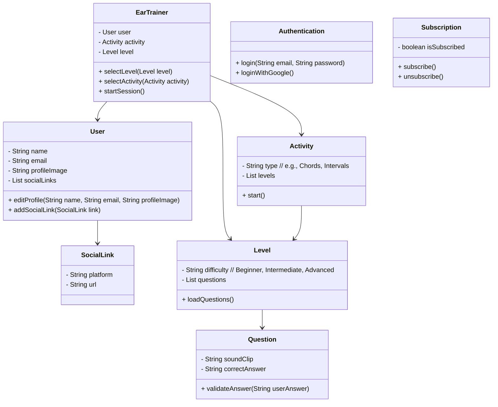

# EarTrainer
O **EarTrainer** é uma API RESTful em Java 21, usando Gradle e Railway, para treinar a percepção musical de intervalos e acordes com atividades interativas e níveis progressivos.
Ele oferece atividades interativas onde os usuários podem ouvir sons e identificar notas, intervalos ou acordes corretamente. O objetivo é aprimorar o ouvido musical de forma progressiva, com diferentes níveis de dificuldade.

Desenvolvido para o projeto final do curso de GFT Desenvolvendo em Java com IA da DIO

## Principais funcionalidades:
- **Seleção de nível**: O usuário pode escolher entre níveis iniciante, intermediário e avançado para cada atividade.
- **Treinamento auditivo:** Atividades para reconhecer acordes e intervalos musicais por meio da audição.
- **Validação de respostas:** O usuário recebe feedback se sua resposta está correta ou errada.
- Autenticação e perfil:** Login via email/senha ou Google OAuth, com um perfil personalizável.
Redes sociais: O usuário pode adicionar e editar suas redes sociais dentro do perfil.

## UX/UI (Figma)

[Acessar >>](https://www.figma.com/design/nWdoJYqm70ZisZ8qdeG17V/EarTrainer?node-id=0-1&t=5aYB5z8hnFgClNc2-1)

## UML

